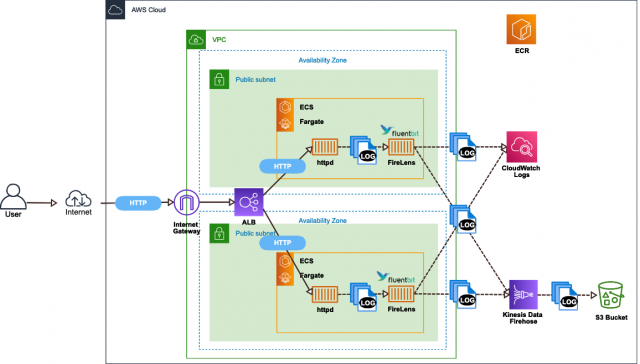
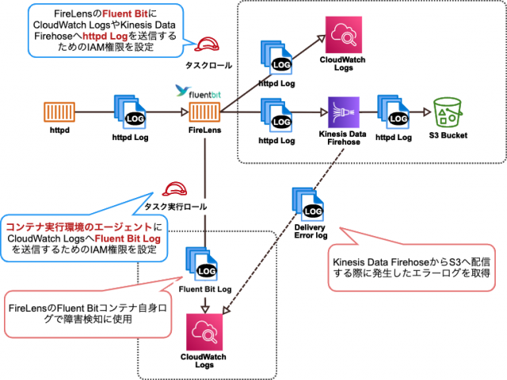

# [Terraform]ECS FargateでFireLensを使って複数サービスにログ出力する

## そもそもFireLensって何？
FireLensは、複数のAWSサービスやAWSパートナーネットワーク(Datadog等)にログ出力することができます。 ECSタスク定義でサイドカーとして起動し、他のコンテナからログドライバーとして使用します。

コンテナイメージにはFluentdとFluent Bitを選択可能です。
今回の検証では、リソース使用率が低く、ログルータに推奨されているFluent Bitを使用します。

2021/11/6時点でFluent Bitでは、以下のAWSサービスにログを出力することができます。

Amazon CloudWatch
Amazon Kinesis Data Firehose
Amazon Kinesis Data Streams
Amazon S3

## FireLens(Fluent Bit)の新旧プラグインに注意
FireLens(Fluent Bit)のプラグインにはC言語のプラグインと、GO言語のプラグインがあります。
新プラグインはC言語のプラグインの方なので、S3以外の対応するAWSサービスはプラグイン指定に注意が必要です。

プラグイン指定はECSタスク定義か、Fluentd又はFluent Bitの設定ファイルのNameに設定します。

新旧プラグインの指定方法の比較表は以下の通りです。

サービス	新プラグイン	旧プラグイン
Amazon CloudWatch	cloudwatch_logs	cloudwatch
Amazon Kinesis Data Firehose	kinesis_firehose	firehose
Amazon Kinesis Data Streams	kinesis_streams	kinesis
Fluent BitのオフィシャルマニュアルにあるAmazon CloudWatchには、以下のような記載があるので、新規構築する場合は基本的に新プラグインを選択して頂くのが良いかと思います。

The Golang plugin was named cloudwatch; this new high performance CloudWatch plugin is called cloudwatch_logs to prevent conflicts/confusion. Check the amazon repo for the Golang plugin for details on the deprecation/migration plan for the original plugin.

## 構成図
今回はECS Fargateで起動したApache httpdコンテナで検証してみました。
Terraformで構築する全体構成図は以下の通りです。

## ログ出力の詳細
ログ出力の詳細な図となります。

各ログ毎の補足事項を、以下にまとめました。

- httpd Log
FireLens経由で、CloudWatch LogsやKinesis Data Firehoseへログ出力します。
FireLensのFluent BitアプリにIAM権限が必要なため、ECSタスクロールに権限が必要です。

- Fluent Bit Log
FireLensのFluent Bitコンテナ自身のログを、ログ配信の障害切り分けのために取得します。 awslogsログドライバーでCloudWatch Logsへログを送信するため、ECSタスク実行ロールに権限が必要です。

ちなみに今回の検証とは別に、awslogsログドライバーのみ使用する場合は、FireLensは不要となります。

- Delivery Error log
Kinesis Data FirehoseからS3へ配信する際のエラーログとなります。
障害切り分けのために、Kinesis Data Firehoseのエラーログ記録を有効化します。

## 検証環境
今回実行した環境は以下の通りです。

Terraform関連
項目	バージョン
- macOS BigSur	11.6
- Terraform	1.0.7
- AWSプロバイダー	3.63.0
コンテナ
項目	バージョン
- httpd	latest(2.4.51)
- amazon/aws-for-fluent-bit	latest(2.21.1)
- Fluent Bit	1.8.9
- Docker Desktop	4.1.1

## ざっくり設計方針
今回コードを書くにあたって、特に意識した方針は以下の通りです。

検証環境のコンテナのイメージタグはlatestタグとする。
※本番環境ではlatestタグの運用はトラブルの元なので避けましょう。ECRでイメージタグの上書き禁止も合わせて設定するのが良いです。
FireLens用のイメージ作成とECRへプッシュも、Terraformのnull_resourceで実施する。
httpd Log用のCloudWatch Logsのログストリーム作成は、Fluent Bitのカスタム設定ファイルで定義し、Fluent Bitから実施できるようにする。
IAMロールにアタッチするIAMポリシーはFull権限を避け、必要最低現にする。
ただし、Fluent Bitのカスタム設定ファイルによるログストリーム作成については、Resourcesは*で定義し、イメージデプロイ担当者に裁量を持たせる。

[This project sets up a Rails application on AWS ECS, using Fluent Bit for log forwarding to Kinesis Firehose and Terraform for infrastructure provisioning.](https://dev.classmethod.jp/articles/terraform-ecs-fargate-firelens-log-output/)